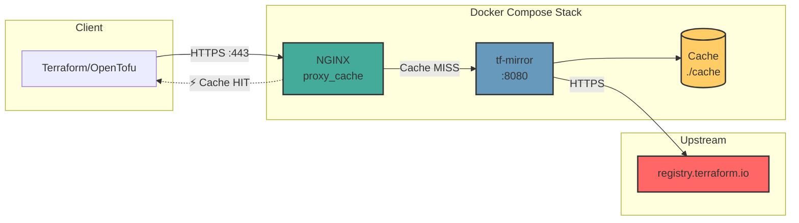
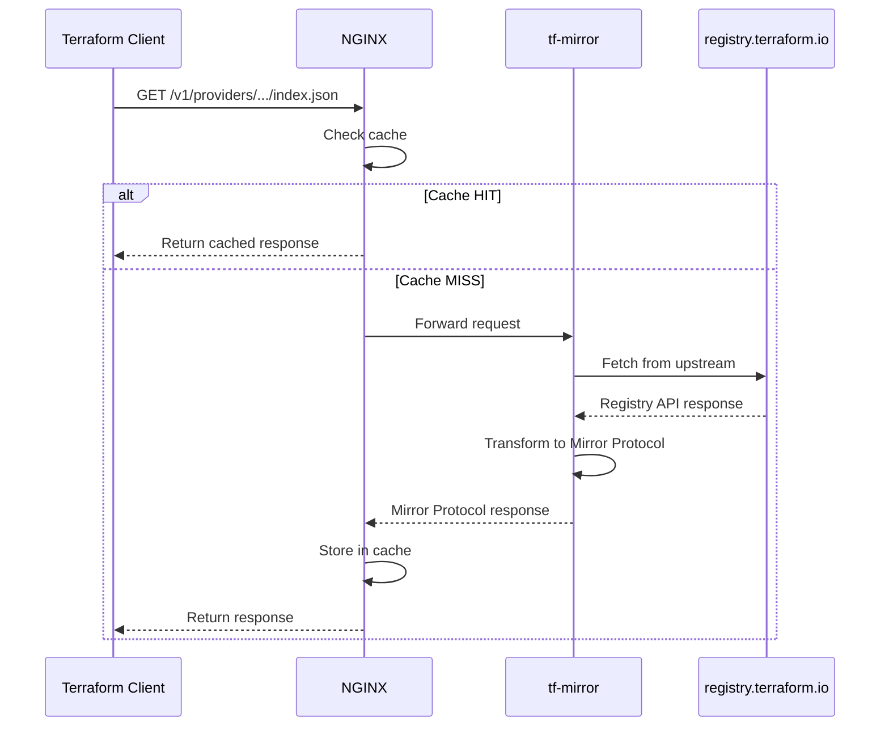

# SCINFRA Terraform Mirror

A server implementation of the [Provider Network Mirror Protocol](https://developer.hashicorp.com/terraform/internals/provider-network-mirror-protocol) that connects with the origin Terraform provider registry via proxy and caches responses using NGINX. Translates standard registry API responses into the mirror protocol format for [Terraform](https://www.terraform.io/) / [OpenTofu](https://opentofu.org/) clients.

## Core Functionality

- **Complete Mirror Protocol implementation** with full JSON responses
- **Automatic hash calculation** for lockfile compatibility
- **Configurable NGINX caching** with original specific TTLs
- **Single Go binary**, container-ready deployment

Enhances Terraform reliability by caching providers locally without breaking protocol compatibility.

## Quick Start

### Production

```bash
docker compose up -d
```

### Local Development

> ⚠️ **Requirements:**
> - VPN may be required (depending on your region's access to registry.terraform.io)
> - Docker Desktop running
> - HTTPS certificates (you need to provide your own, e.g., via [mkcert](https://github.com/FiloSottile/mkcert) for local dev)

#### 1. Prepare HTTPS Certificates

Place your certificates in the `certs/` directory:
```
certs/
├── localhost.pem        # Certificate
└── localhost-key.pem    # Private key
```

#### 2. Start Services

```bash
docker compose up -d

# Verify
curl -k https://localhost/health
# {"status":"ok"}
```

#### 3. Configure Terraform

```bash
cat > ~/.terraformrc << 'EOF'
provider_installation {
  network_mirror {
    url     = "https://localhost/v1/providers/"
    include = ["registry.terraform.io/*/*"]
  }
  direct {
    exclude = ["registry.terraform.io/*/*"]
  }
}
EOF
```

#### 4. Test

```bash
cd example
terraform init
```

**Expected output:**
```
Initializing the backend...
Initializing provider plugins...
- Finding scinfra-pro/aeza versions matching "~> 0.3.1"...
- Installing scinfra-pro/aeza v0.3.1...
- Installed scinfra-pro/aeza v0.3.1 (unauthenticated)

Terraform has been successfully initialized!
```

Add hashes for all platforms (removes warning):
```bash
terraform providers lock -platform=darwin_amd64 -platform=darwin_arm64 -platform=windows_amd64
```

## Configuration (localhost dev stage)

Configuration via environment variables:

| Variable | Default | Description |
|----------|---------|-------------|
| `TF_MIRROR_LISTEN` | `:8080` | Server listen address |
| `TF_MIRROR_UPSTREAM_URL` | `https://registry.terraform.io` | Upstream registry URL |
| `TF_MIRROR_CACHE_DIR` | `./cache` | Cache directory |
| `TF_MIRROR_LOG_LEVEL` | `info` | Log level (debug, info, warn, error) |

## Caching

Caching is implemented via NGINX `proxy_cache`:

| File Type | TTL | Description |
|-----------|-----|-------------|
| `index.json` | 1 hour | Provider version list |
| `{version}.json` | 24 hours | Platform information |
| `*.zip` | 1 year | Provider archives (immutable) |

## Architecture



### Request Flow



## Project Structure

```
terraform-mirror/
├── main.go                 # Entry point
├── internal/
│   ├── cache/              # File-based hash cache
│   ├── config/             # Configuration from ENV
│   ├── hash/               # h1 hash calculation (dirhash)
│   ├── registry/           # Registry API client
│   ├── server/             # HTTP server & handlers
│   └── upstream/           # HTTP client for upstream
├── nginx/                  # NGINX configuration
├── example/                # Test Terraform project
├── Dockerfile
├── docker-compose.yml
└── Makefile
```

## Development

```bash
# Run locally
make run

# Build for Linux
make build

# Run tests
make test

# Check health
make health
```

## Inspired by

- [bdalpe/tf-registry-mirror](https://github.com/bdalpe/tf-registry-mirror) — Caching proxy for Terraform/OpenTofu Provider Registry (TypeScript + NGINX)
- [kashtan404/tf-mirror](https://github.com/kashtan404/tf-mirror) — Self-hosted mirror for Terraform Provider Registry (Go)

## License

MIT
